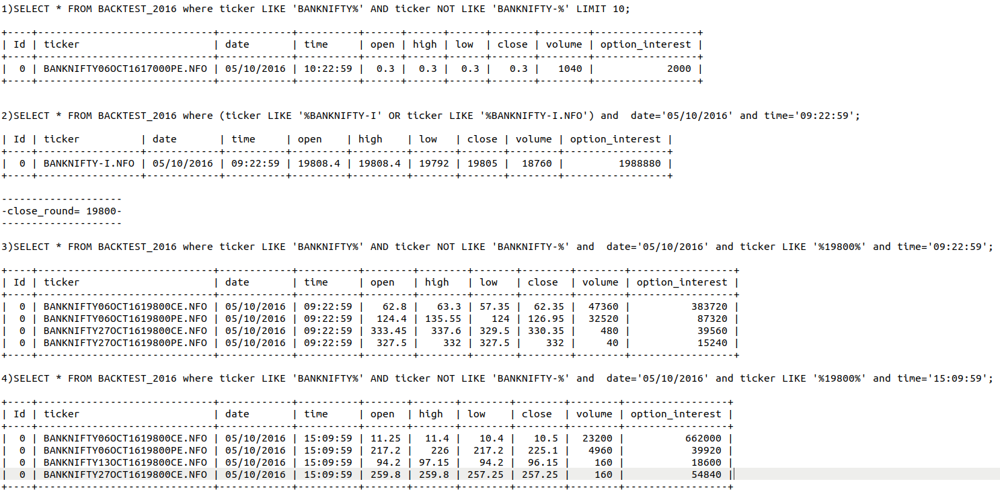

# Algo Info
* Get All BANKNIFTY--> Like  (BANKNIFTY03AUG1723000PE)--single record for day one
* Based on day one date we need to get search in ALGO-1-->Result_Data
* In Result_Data we need to round nearest 100 of closing price. --->9:22:59(only)

- we got rounded_value --> rounded_value we need to search inside All BANKNIFTY(same date)

- we got the BANKNIFTY_RESULT based on rounded value -> BANKNIFTY03AUG1723000PE

- we need to find out PE and CE for 9:22 and 3:10---> both closing we need to add X_9 and Y_3---> (X_9-Y_3) 

## Use full Query and logic we build #

* 09_22_59-->
 09_22_59_close_ce = 62.35
 09_22_59_close_pe = 126.95
 09_22_59_close_ce = 330.35
 09_22_59_close_pe = 332
 

sub_of_ce_and_pe_5th = 09_22_59_close_ce + 09_22_59_close_pe

* 15_09_5-->
 15_09_59_close_ce = 10.5
 15_09_59_close_pe = 225.1
 15_09_59_close_ce = 96.15
 15_09_59_close_pe = 257.25

sub_of_ce_and_pe_6th = 15_09_59_close_ce + 15_09_59_close_pe

minus_of_5th_and_6th = sub_of_ce_and_pe_5th + sub_of_ce_and_pe_6th

